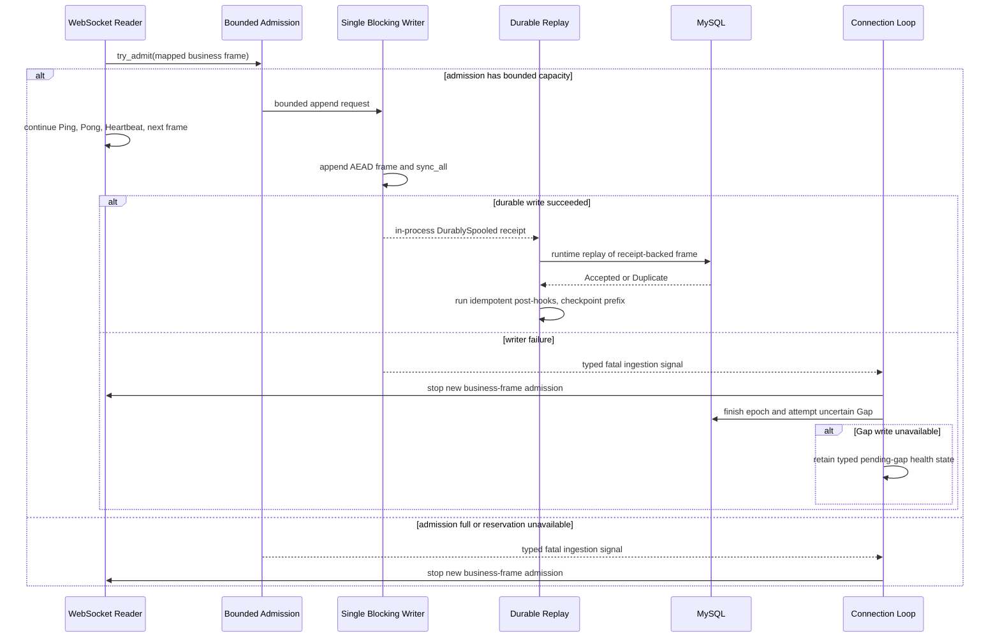

# GAP-007 普通消息实时入站本地磁盘 Spool 决策

> 最后修订：2026-08-05 23:25（Asia/Shanghai）
> 状态：**GO；IMPL-A/B 已通过 Codex 独立复核；尚未接入 runtime 或 MySQL replay**
> 范围：NapCat WebSocket 群聊/私聊普通消息的本地耐久接收边界

## 1. 结论

**GO，架构决策已通过独立复核**。用户确认的五项决策、运行期 receipt 与跨重启 WAL 恢复边界、
pending Gap 持久化、遗留 epoch 的崩溃收敛恢复顺序均已闭合。`GAP-007-IMPL-A` 的协议中立
领域/application 契约与独立文件适配器已通过 Codex 独立门禁；本规格不表示 runtime、配置、迁移、
Worker 或 MySQL 恢复实现已存在。

所承诺的交付语义严格限于：正常运行期一条普通消息获得本地 `DurablySpooled` receipt 后，才允许
进入 MySQL replay；重启恢复另以完整认证 WAL 帧为准。它不表示 NapCat/QQ 已确认、不表示平台会
重投，也不表示端到端或 hook exactly-once delivery。

## 2. 当前路径与失效模型

普通消息当前经过以下本地状态：

1. **Received**：WebSocket 收到 Text 帧，`handle_ws_message` 调用业务 handler。
2. **InMemory**：handler 映射群聊或私聊消息并调用 `try_enqueue`，成功后消息只在有界
   `tokio::mpsc` 或 Worker 已领取的微批内存中。
3. **DurablySpooled**：当前不存在这个状态。
4. **MysqlCommitted**：`insert_messages_if_absent` 的微批事务 commit 成功；随后才运行
   Recall/Artifact post-hook。

`InMemory` 不是持久化成功。进程崩溃、主机断电或正常关闭排空超时都会丢失所有未进入
`MysqlCommitted` 的本地副本。

当前 transport 的实情同样是边界的一部分：Text handler 返回错误时，
`qqbot/src/napcat/listener/transport.rs` 只记录 warning，随后返回 `Ok(false)` 继续读取。
因此当前 `try_enqueue` 的 `Full` 不会自动终止连接或结束 epoch。NapCat 正向 WebSocket 没有
逐消息 ACK；本地 handler 成功或失败都不能推导平台重投。

| 失效点 | 当前结果 | 可证明的恢复边界 |
|---|---|---|
| callback 后、入队前进程崩溃 | 当前消息本地副本丢失；NapCat 是否重投未证明 | 只能尝试建立 uncertain Gap；历史是否可取回不确定 |
| 入队后、MySQL commit 前进程崩溃或断电 | 队列和 in-flight 微批本地副本丢失 | 同上 |
| 队列满 | `try_enqueue` 返回 `Full`，消息不入队；Worker 尝试持久化 QueueOverflow Gap | transport 记录 handler 错误并继续；Gap 写入也可能因 MySQL 离线失败 |
| MySQL 暂时离线 | Worker 仅在进程内持有批次并退避重试 | 进程存活时可恢复；崩溃或排空超时后仍有丢失窗口 |
| 磁盘满、密钥错误、锁冲突、WAL 撕裂、完整帧损坏 | 当前普通消息路径没有本地 WAL | 没有对应恢复能力，以下仅为拟议实现契约 |

GAP-003 可从已知 scope 有界恢复候选，并复用幂等入口；它不能替代 callback 侧耐久性。
`EXTERNAL ENV-004` 尚未验证真实 NapCat 的多页方向、空页原因、跨重启覆盖和 PacketBackend，
所以 Backfill 不能证明普通消息丢失已经完整恢复。

## 3. 候选方案与选择

| 方案 | 耐久确认语义 | 结论 |
|---|---|---|
| 保持现状 | 成功进入内存 `mpsc` | 可继续现状，但 commit 前不可耐久 |
| 在 WebSocket handler 直接 `std::fs` append/sync | 逻辑上等待单帧落盘 | 拒绝：阻塞同一 Tokio 接收任务的 Ping、Heartbeat 与后续帧 |
| callback 入内存后后台异步转存 | 只有内存接受 | 拒绝：进程可在 append 前崩溃，不能称 durable |
| 专用 blocking writer、逐帧 durable receipt、异步 MySQL replay | receipt 驱动运行期 replay；WAL 驱动启动恢复 | **采用，进入分批实现** |

## 4. 并发与生命周期模型

reader 不执行文件 I/O，也不等待 durable receipt 才读取下一个 WebSocket 帧。它只执行有界、
非阻塞的业务帧 admission；receipt 是 writer 发给 replay 的内部状态，不是 handler 返回值，更不是
平台 ACK。未来 transport 必须把 fatal ingestion 结果传播到 connection loop，而普通业务拒绝保持
recoverable。

Admission has both a bounded request count and bounded reserved bytes. It must reject before accepting a frame
when either limit would be exceeded; it may not build an unbounded in-memory retry list. A successful admission
is still only pending, not `DurablySpooled`.

`DurablySpooled` receipt is an in-process notification used only to start **runtime** replay. It is not written
as a WAL recovery flag and it is not a requirement for startup replay: the process can crash after `sync_all`
succeeds but before the receipt is delivered. If the writer terminates while the current process is alive,
unreceipted admissions fail as fatal and receive no runtime replay; this does not decide whether a complete WAL
frame was already made durable before the termination.

On fatal, the reader continues protocol-required close/Ping handling only as needed for orderly shutdown, but it
accepts no new business frames. The typed fatal travels through future transport changes to `connection_loop`,
which ends the current epoch and invokes the existing uncertain Gap flow. If Gap persistence is unavailable, the
process retains a typed pending-gap health state; it must not claim the Gap was recorded.

Shutdown first disables business admission, then gives accepted writer requests a bounded deadline to return a
receipt. It may stop MySQL replay at the deadline, but it may not delete non-checkpointed frames. A request that
has no receipt at that deadline must not be classified as "not replayable": after restart, a complete,
authenticated frame in the valid WAL generation is replayed; only an incomplete tail frame is truncated. The
epoch that contained the shutdown/fatal window must enter persistent Gap reconciliation before a new connection.

## 5. 已确认决策

### 5.1 交付语义：本地耐久接收

运行期只有 `DurablySpooled` receipt 成功的帧可进入 MySQL replay。该 receipt 表示独立 writer 已
完整写入 AEAD 帧并完成本节规定的同步协议；它不是 NapCat/QQ ACK，也不承诺平台重投、端到端
delivery 或 exactly-once delivery。

重启恢复不读取旧进程 receipt。恢复资格只依据有效 WAL generation 与已耐久 checkpoint 后的帧：
完整、长度有效、版本允许、认证成功且反序列化成功的帧必须安全重放，即使旧进程在收到 receipt 前
崩溃。唯一可截断的记录是扫描证明的最后一个未完成尾帧；它及同一未结束 epoch 必须进入第 6 节的
持久 Gap reconciliation。

### 5.2 完整帧损坏：全局 fail-closed

任何非尾部完整帧的认证、版本或反序列化失败都使整个普通消息 Spool 全局 fail-closed：停止恢复、
停止新业务消息接收、保留所有现场，等待人工处置。不得越过、删除、quarantine 后继续、compact，
也不得暴露账号或 epoch 恢复作用域以继续运行。

撕裂尾部是唯一不同情况：仅当扫描证明最后一个帧不完整时，才可截断该未完成尾帧到最后一个已验证
前缀，并按 Windows 同步协议持久化 truncate。完整损坏帧绝不当作撕裂尾部处理。

### 5.3 Post-hook：至少一次调用、幂等效果收敛

同一 receipt 可以至少一次调用 post-hook。不得宣称 hook 代码只执行一次。可观察数据库效果必须
依赖稳定下游 idempotency key 收敛：Recall 使用既有关联键，Artifact 使用确定性 `ArtifactId`。

新增 hook 只有在能证明稳定 idempotency key 和安全重试后，才可加入 Spool checkpoint 必需 hook
集合；无法证明的 hook 不得阻塞 checkpoint，也不得随 Spool 接入。若现有 Recall 或 Artifact 实现
无法证明收敛，本切片只记录阻塞，不新增迁移或生产实现。

`SourceEvent` 继续由现有幂等键保证至多一个。checkpoint 只能越过 MySQL 已 commit、且全部已配置
的必需 hook 已经以稳定 key 收敛的连续前缀；Duplicate replay 可以再次调用 hook，但其可观察效果
必须不重复。

### 5.4 总磁盘预算：512 MiB

普通消息 Spool 的所有实际分配字节总和不得超过 **512 MiB**，按文件系统实际占用和分配粒度记账：

| 分区 | 硬上限 | 规则 |
|---|---:|---|
| 活动 WAL | 240 MiB | 未 checkpoint 帧只能追加到此上限；不得覆盖、驱逐或删除 |
| compact 临时文件 | 240 MiB | compact 只在完整预留可用时开始；不得借用 quarantine 或元数据余量 |
| quarantine | 16 MiB | 仅保存可选诊断副本；满额后不再复制、不删除既有证据；完整损坏仍全局 fail-closed |
| checkpoint、锁、元数据、恢复余量 | 16 MiB | 任何超额或无法创建必要元数据都为 fatal |

compact 峰值必须同时容纳旧活动 WAL 和完整临时文件，因此不得在未预留 240 MiB 临时分区时启动。
quarantine 不参与完整损坏帧的继续恢复：若诊断副本会超过 16 MiB，留下原始现场并进入 fatal，
不删除或移动原帧。

预算耗尽、磁盘满、append/sync 失败或 writer 终止均是类型化 fatal。系统停止新业务帧 admission，
结束当前 epoch，并等待人工扩容，或在 MySQL 恢复后将已 durable 的前缀 replay/checkpoint/compact
以释放活动 WAL。禁止静默驱逐、循环覆盖、删除未 checkpoint 帧或无界 quarantine。

### 5.5 Fatal 传播

未来 transport 改造必须区分 recoverable handler 结果和 fatal ingestion 结果。普通业务拒绝保持
recoverable；Spool 密钥、锁、容量、append、sync、writer 终止属于 fatal，必须脱敏传播到
`connection_loop`，结束当前 epoch 并触发现有 uncertain Gap 流程。

密钥或锁在 epoch 创建前失败时，listener 不启动，不能伪造 Gap。epoch 已创建后发生 fatal 时，必须
以同一 epoch 持续、幂等地重试结束 epoch 与持久化 uncertain Gap；每次失败保留类型化 pending-gap
健康状态，但该内存状态不是恢复证据。日志、错误和健康状态不得含正文、账号、QQ ID、群号、Actor ID、
message_id/message_seq、Token、URL、密钥、响应 data 或本地敏感路径。

## 6. 帧、锁与恢复契约

- 每条普通消息使用独立 AEAD 帧。正文、segments、账号、会话、Actor、消息锚点与 epoch 必须在
  密文内；帧头仅含 magic、格式版本、key id、长度和 nonce。读取先做版本、声明长度、`max_frame`
  和认证校验，且不得无界分配。
- 密钥只从专用环境变量注入；缺失、错误或未知 key id fail-closed，不得回退明文、默认密钥或用
  新空文件覆盖旧数据。
- 单一 blocking writer 在全部 WAL、checkpoint、compact 和恢复阶段持有独占锁。锁冲突、恢复无法
  确定最后验证前缀或任何完整帧损坏均不启动 listener。
- 启动恢复以有效 WAL generation 和已耐久 checkpoint 为准，而非旧进程 receipt。扫描其中每个完整、
  认证成功且可反序列化的未 checkpoint 帧并重放；不得用 QQ `message_seq` 做数值排序或重建游标。
  唯一允许 truncate 的是最后一个不完整尾帧；任何完整帧失败触发全局 fail-closed。
- 遗留 epoch 恢复是文件系统与 MySQL 之间的**崩溃收敛协议**，不是跨资源原子事务。取得普通消息
  Spool 单实例锁后，先验证 WAL generation/checkpoint 并按原 epoch 枚举未 checkpoint 完整帧。
- 遗留 `connected` epoch 在 replay 期间必须保持 `connected`：依次通过现有统一幂等入口重放完整帧，
  等待 MySQL commit 与必需 hook 效果收敛，再耐久推进对应 WAL checkpoint。只有 checkpoint 成功后，
  才以单个 MySQL 事务结束原 epoch、创建或复用 uncertain Gap 并冻结 Gap 证据。
- 遗留 `connecting` epoch 若没有任何归属帧，按连接失败原子结束且不伪造消息 Gap；若 WAL 中存在
  归属于 `connecting` epoch 的完整消息帧，说明业务 admission 发生在连接确认之前，属于不变量破坏，
  必须全局 fail-closed，不能把 epoch 改成 connected 后继续 replay。
- 若在 replay、hook、checkpoint 或 epoch/Gap 事务任一点崩溃，下一次启动从 WAL 与 MySQL 已提交事实
  重新执行：SourceEvent、hook 效果和 Gap 写入分别依靠既有或拟议稳定键收敛。checkpoint 前崩溃会
  重放；checkpoint 后、结束 epoch 前崩溃会再次发现遗留 epoch 并只执行结束/建 Gap 阶段。
- 所有遗留 epoch 完成上述流程前 listener 不得建立新连接。现有 `IngestionContinuityStoreT`/MySQL
  实现尚无该类型化恢复入口，`GAP-007-IMPL-A` 必须先定义端口，后续 MySQL 实现只能让数据库内的
  epoch 结束、Gap 创建和证据冻结保持原子，不能宣称与文件 checkpoint 跨资源原子。
- 遗留 epoch 的领取必须显式按 `SourceAccountRef` 隔离，并返回包含 typed lease token 的 claim；
  `connecting` 结束和 `connected` 最终收口只能接收该 claim，后续 MySQL 实现必须在事务内复验
  账号、epoch、token 与租约未过期，旧恢复执行者不得越过新租约完成写入。
- 普通消息 Spool 与 Recall Spool 必须有独立文件/目录、锁、密钥与 key id、帧格式、容量、
  quarantine、telemetry、checkpoint 和生命周期。不得复制后改名或共享确认状态。

健康快照只包含 bytes、capacity、pending、oldest age、quarantine count、最近类型化错误和
pending-gap/reconciliation-pending 状态；不包含任何敏感业务标识或内容。

## 7. Windows 耐久协议（待故障注入验证）

以下是 Windows 上的拟议最低协议，不是已验证保证。任一步无法证明或失败都 fail-closed，禁止
静默降级；`sync_data` 不得作为断电耐久证据。

| 操作 | 拟议同步步骤 | 未验证时的行为 |
|---|---|---|
| append 帧和文件长度 | 写完整帧，调用 `sync_all`，成功后才发 durable receipt | 不发 receipt，返回 fatal |
| 撕裂尾部 truncate | 只截断已判定不完整的最后帧，调用 WAL `sync_all` 后重扫确认 | 保留现场并 fail-closed |
| checkpoint | 写临时 checkpoint，`sync_all`，原子替换，重新打开并 `sync_all`；父目录/元数据同步必须有经验证原语 | 不推进 checkpoint，fail-closed |
| compact | 写临时 WAL 并 `sync_all`，保留旧 WAL，原子替换，验证新文件与元数据持久化后才清理旧文件 | 保留旧文件，停止 admission，fail-closed |
| 父目录和原子替换 | 使用能证明 Windows 原子替换与父目录持久化的原语；标准库不足时先提交独立平台设计 | 不执行 compact/checkpoint 替换 |

`GAP-007-IMPL-D` 已通过可控故障点覆盖 WAL 创建、append、truncate、checkpoint、compact 临时文件、
原子替换前后目标文件同步和父目录/Windows 写穿边界。测试分别证明替换前失败保留旧权威文件、替换后
失败由新权威文件在重启时收敛；同步失败不产生运行期 receipt。该结论限定于仓库实现与本地 Windows
文件系统故障等价点，不替代真实断电硬件验证。

## 8. 实现切片边界

本规格已经通过独立复核，`TODO.md` 可以创建以下未完成任务。各切片必须独立实现、验证和提交：

1. **GAP-007-IMPL-A，领域契约**：已完成并通过 Codex 独立复核。`personal-secretary` 已具备 typed
   admission、运行期 durable receipt、WAL-based recovery eligibility、recoverable/fatal result、
   账号作用域且带 lease fencing 的遗留 epoch 分阶段恢复、checkpoint eligibility 与稳定 hook
   idempotency key 证明；本切片没有实现文件 WAL 或 runtime 接线。
2. **GAP-007-IMPL-B，文件适配器**：已完成并通过 Codex 独立复核。独立 AEAD WAL、512 MiB
   实际分配预算、独占锁、最终尾部截断、完整帧全局 fail-closed、连续 checkpoint、compact 与
   Windows 写穿替换均已实现；blocking writer 调度、runtime 接线和 MySQL replay 留在 IMPL-C。
3. **GAP-007-IMPL-C，runtime/health**：已完成并通过 Codex 独立复核。callback 只做 bounded
   admission；blocking writer 同步成功后把 durable frame 交给统一 ingestion。MySQL commit 与必需
   hook 收敛后推进连续 checkpoint；fatal/关闭超时保留开放 epoch 与 WAL，启动恢复使用账号作用域
   typed lease、续租和 fencing，完成后原子创建/复用 uncertain Gap。健康快照不暴露业务标识或路径。
4. **GAP-007-IMPL-D，故障注入**：已完成并通过 Codex 独立复核。专用 OS writer 线程与有界
   admission 保持 Tokio timer 公平；receipt 前完整帧、关闭 deadline、尾部撕裂、全局损坏、遗留
   epoch、预算、MySQL 离线、必需 hook effect 和 Windows 各同步点均有恢复或 fail-closed 证据。

`EVT-009-CANCELLED` 保持取消；本规格不恢复数据库正文加密、密钥轮换、迁移或相关 Worker。
官方 QQ Open Platform send_text、当前 WebSocket 入站行为、Heartbeat 和 Directory 均未修改。
